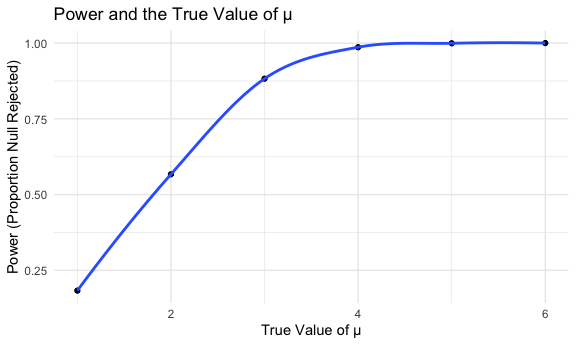
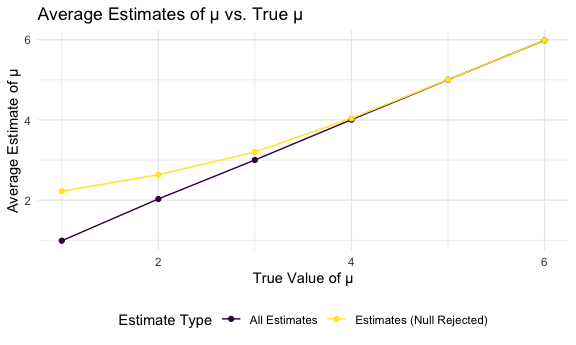

p8105_hw5_wd2311
================
wd2311
2025-11-14

## Loading package

``` r
library(tidyverse)
```

    ## ── Attaching core tidyverse packages ──────────────────────── tidyverse 2.0.0 ──
    ## ✔ dplyr     1.1.4     ✔ readr     2.1.5
    ## ✔ forcats   1.0.0     ✔ stringr   1.5.2
    ## ✔ ggplot2   4.0.0     ✔ tibble    3.3.0
    ## ✔ lubridate 1.9.4     ✔ tidyr     1.3.1
    ## ✔ purrr     1.1.0     
    ## ── Conflicts ────────────────────────────────────────── tidyverse_conflicts() ──
    ## ✖ dplyr::filter() masks stats::filter()
    ## ✖ dplyr::lag()    masks stats::lag()
    ## ℹ Use the conflicted package (<http://conflicted.r-lib.org/>) to force all conflicts to become errors

``` r
library(rvest)
```

    ## 
    ## Attaching package: 'rvest'
    ## 
    ## The following object is masked from 'package:readr':
    ## 
    ##     guess_encoding

## Figures settings

``` r
knitr::opts_chunk$set(
  fig.width = 6,
  fig.asp = .6,
  out.width = "90%"
)

theme_set(theme_minimal() + theme(legend.position = "bottom"))

options(
  ggplot2.continuous.colour = "viridis",
  ggplot2.continuous.fill = "viridis"
)

scale_colour_discrete = scale_colour_viridis_d
scale_fill_discrete = scale_fill_viridis_d

set.seed(1)
```

# Problem 1

## Define birthday-checking function

``` r
bday_sim = function(n_room) {
  birthdays = sample(1:365, n_room, replace = TRUE)
repeated_bday = length(unique(birthdays)) < n_room
repeated_bday
}

bday_sim(20)
```

    ## [1] FALSE

## 10000 simulation runs

``` r
bday_sim_results = 
  expand_grid(
    bdays = 2:50,
    iter = 1:10000
  ) |> 
  mutate(
    result = map_lgl(bdays, bday_sim)
  ) |> 
  group_by(bdays) |> 
  summarize(
    prob_repeat = mean(result)
  )
```

## Plot the function

``` r
bday_sim_results |> 
  ggplot(aes(x = bdays, y = prob_repeat)) +
  geom_point() +
  geom_line() +
  labs(
    x = "Group Size", 
    y = "Probability",
    title = "Probability of Sharing Birthday for Increasing Group Size"
  )
```


The probability is very small for small groups, but it rises quickly as
group size increases. Around 23 people, the probability is already about
0.5—there’s roughly a 50% chance that at least two people share a
birthday.By about 40–50 people, the probability is above 90%,
approaching 1 as the group grows. This is the classic birthday paradox.
Even though there are 365 possible birthdays, we don’t need anything
close to 365 people before a match becomes very likely. The curve’s
steep, nonlinear rise shows how quickly shared birthdays become almost
guaranteed as the group size increases.

## Problem 2

## Set 𝜇=0 and Generate 5000 datasets from the model

``` r
powermu_zero = 
  expand_grid(
    sample_n = 30,
    sample_sd = 5,
    mu = 0,
    iter = 1:5000
  ) |> 
  mutate(data = map(iter, ~rnorm(sample_n, mean = mu, sd = sample_sd))) |> 
  mutate(tidy = map(data, ~broom::tidy(t.test(.x, mu = 0)))) |> 
  mutate(mu_hat = map_dbl(tidy, "estimate"),
         p_value = map_dbl(tidy, "p.value"))
```

## Repeat the above for 𝜇={1,2,3,4,5,6}

``` r
power_sim = 
  expand_grid(
    mu = 1:6, 
    iter = 1:5000) |> 
  mutate(
    data = map(mu, ~ rnorm(n = 30, mean = .x, sd = 5)),
    ttest = map(data, ~broom::tidy(t.test(.x, mu = 0)))
    
  ) |> 
  unnest(ttest) |> 
  select(mu, iter, estimate, p.value)
```

## Describe the association between effect size and power.

``` r
power_sim |> 
  group_by(mu) |> 
  summarize(
    power = mean(p.value < 0.05)
  ) |> 
  ggplot(aes(x = mu, y = power)) +
  geom_point() +
  geom_smooth(se = FALSE) +
  labs(
  x = "True Value of μ",
  y = "Power (Proportion Null Rejected)",
  title = "Power and the True Value of μ"
)
```

    ## `geom_smooth()` using method = 'loess' and formula = 'y ~ x'



As the true value of μ increases, the power of the one-sample t-test
increases sharply. When μ is near zero, the probability of rejecting the
null hypothesis is near the nominal α = 0.05. As μ grows from 1 to 3,
the test becomes increasingly sensitive and power rises rapidly. For μ ≥
4, power approaches 1, meaning the test almost always detects the
effect. This demonstrates that larger effect sizes lead to higher power,
given fixed sample size and variance.

## Average Estimates of μ vs. True μ

``` r
power_sim |> 
  group_by(mu) |> 
  summarize(
    avg_est = mean(estimate),
    avg_est_rejectnull = mean(estimate[p.value < 0.05], na.rm = TRUE)
  ) |> 
  pivot_longer(cols = c(avg_est, avg_est_rejectnull),
               names_to = "type",
               values_to = "value") |> 
  ggplot(aes(x = mu, y = value, color = type)) +
  geom_line() +
  geom_point() +
  scale_color_viridis_d(labels = c("All Estimates", "Estimates (Null Rejected)")) +
  labs(
    x = "True Value of μ",
    y = "Average Estimate of μ",
    color = "Estimate Type",
    title = "Average Estimates of μ vs. True μ"
  )
```



The average μ̂ among samples where the null is rejected is not equal to
the true μ, especially when μ is small.This is because restricting to
significant tests selects only the samples in which random noise pushed
μ̂ upward enough to pass the significance threshold. This creates upward
bias in the estimate, known as the “winner’s curse” or significance
filter bias. Only when μ is large and power is high do the two averages
converge and become approximately equal.
